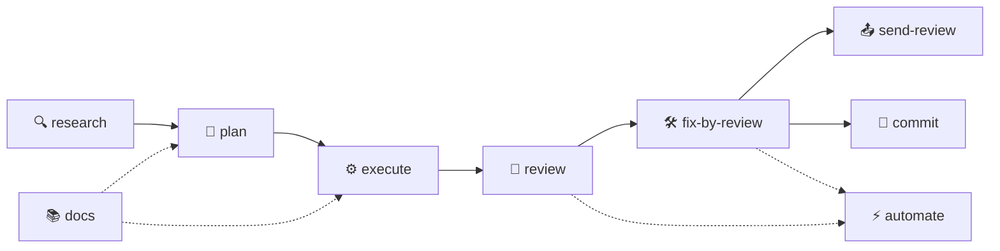

# 🌊 eda

> Поточная разработка с AI-агентами — на русском языке.
> Набор готовых скилов для **Claude Code** и **Codex CLI**, которые ведут тебя через весь цикл: от исследования до коммита.

`eda` — это девять скилов, каждый отвечает за свой кусок работы. Вместо того чтобы каждый раз объяснять модели, как делать ревью или как исполнять план, ты говоришь одно слово — и она следует чёткой инструкции на русском, со всеми правилами, проверками и артефактами в нужных папках.

---

## ⚡ Установка

```bash
npm install -g @gian-tiaga/eda
```

В корне твоего проекта:

```bash
eda init
```

Скил спросит, куда ставить — в Claude Code, в Codex или в обе среды сразу. Дальше можно работать.

---

## 🛠️ Скилы

| Скил | Что делает | Куда складывает |
|---|---|---|
| `eda-research` | Глубоко изучает тему или задачу. Без правок кода. Все вопросы — через интерактивный диалог. На выходе — понятный отчёт со ссылками на источники, диаграммами и таблицами | `docs/researches/` |
| `eda-plan` | Пишет план реализации через стандартный Plan Mode хост-агента. Подтягивает контекст из `docs/rules.md`, `docs/arch.md`, при желании — релевантное исследование. Затем три параллельных модели (слабая, средняя, мощная) проверяют план на реалистичность, пропущенные шаги и нарушения правил — главный планировщик сам решает, что применить | `docs/plans/` |
| `eda-execute` | Выполняет план. Спрашивает, где работать (текущая ветка, новая ветка, отдельный worktree). Тесты пишет внутри каждого шага. В конце — полный прогон тестов и линтеров | `docs/executions/` |
| `eda-review` | Делает код-ревью с оценкой 0–100. Затем три параллельных модели (Sonnet, Haiku, Opus) проверяют само ревью — добавляют пропущенное, убирают лишнее. В строгом режиме — ещё и кросс-ревью между Claude и Codex | `docs/reviews/` |
| `eda-fix-by-review` | Применяет замечания из ревью. Обязательные — сразу. Спорные — спрашивает. В конце ссылается на отчёт прямо в файле ревью | `docs/review-fixes/` |
| `eda-send-review` | Отправляет ревью на GitHub PR через `gh` — как комментарий, review, approve или request-changes. Сам определяет PR по текущей ветке | (комментарий в PR) |
| `eda-commit` | Делает один аккуратный коммит в стиле проекта. В конце спрашивает: push, merge в main + удалить ветку, или ничего | (git) |
| `eda-docs` | Создаёт или обновляет `docs/rules.md` (максимально строгие правила для твоего стека), `docs/arch.md` (архитектура проекта) и шапку `AGENTS.md`. Может предлагать инструменты, которых ещё нет в проекте | `docs/rules.md`, `docs/arch.md`, `AGENTS.md` |
| `eda-automate` | Анализирует историю ревью и фиксов. Если какое-то замечание встречается раз за разом — предлагает кастомное правило линтера или статанализатора, чтобы ловить это автоматически | `docs/automations/` |

---

## 🚩 Флаги скилов

У некоторых скилов есть флаг `strict` — он включает дополнительные тяжёлые проверки. Передаётся как часть запроса агенту, например: `eda-research strict <тема>` или просто `сделай ревью этого PR в strict-режиме`.

Скилы, которых нет в таблице ниже, флагов не поддерживают — у них всё включено по умолчанию.

| Скил | Флаг | Что включает | Когда стоит использовать |
|---|---|---|---|
| `eda-research` | `strict` | После сохранения отчёта отдаёт его соседнему CLI (Claude → Codex или наоборот) на критическое ревью; затем доправляет отчёт по их замечаниям | Серьёзные исследования, которые лягут в основу больших решений; когда хочется второго мнения от другой модели/среды |
| `eda-plan` | `strict` | После мета-ревью трёх моделей (это есть всегда) отдаёт план соседнему CLI на дополнительный круг проверки; доправляет план | Большие или ответственные планы, особенно затрагивающие смежные системы |
| `eda-review` | `strict` | После мета-ревью тремя моделями (Sonnet/Haiku/Opus — это есть всегда) отдаёт ревью соседнему CLI на дополнительный круг проверки; доправляет ревью по его замечаниям | Ревью важных PR; когда нужен максимальный охват |

---

## 🔄 Воркфлоу



Использовать всю цепочку не обязательно — каждый скил самодостаточен. Можно начать с `eda-research`, или сразу с `eda-execute` на готовом плане, или просто `eda-commit`, когда правки уже сделаны.

---

## 🎯 Главные принципы

- **Простой язык.** Скилы общаются с тобой так, чтобы понял человек без глубоких знаний предмета. Термины — только когда без них нельзя.
- **Все вопросы — интерактивно.** В Claude Code — через `AskUserQuestion`; в интерактивном Codex — через `request_user_input` или блокирующий вопрос в чат. В `codex exec` и других неинтерактивных запусках скил не имитирует диалог: если без ответа нельзя безопасно продолжать, он завершает работу со статусом `blocked: нужен ответ пользователя`.
- **Артефакты по папкам.** Исследования отдельно, планы отдельно, ревью отдельно. Между файлами — ссылки. Через месяц легко найти, кто что когда решал.
- **Границы между скилами жёсткие.** `execute` не коммитит — это работа `commit`. `review` не правит код — это `fix-by-review`. Никаких размытых ответственностей.
- **Доверие модели.** Скилы короткие. Они говорят «что» и «почему», а «как именно» — модель разбирается сама.

---

## 💻 Команды

```bash
eda init      # выбрать Claude Code / Codex / обе среды и установить скилы
eda update    # обновить уже установленные скилы из текущей версии пакета
eda --help    # справка
```

Когда выходит новая версия пакета:

```bash
npm update -g @gian-tiaga/eda    # подтянуть новый код
eda update           # синхронизировать скилы в текущем проекте
```

---

## 📁 Куда устанавливаются скилы

| Среда | Куда |
|---|---|
| **Claude Code** | `<project>/.claude/skills/<skill>/SKILL.md` — отдельная папка на каждый скил |
| **Codex CLI** | `<project>/.codex/skills/<skill>/SKILL.md` — отдельная папка на каждый скил |

`eda update` идемпотентно перезаписывает файлы в обеих папках. При обновлении старые файлы Codex-формата `<project>/.codex/skills/<skill>.md`, созданные версиями `eda` до этой структуры, удаляются. Если ты хочешь подправить скил локально — лучше копию сделай рядом, а не прямо в `.claude/skills/` или `.codex/skills/`, иначе при следующем `update` твои правки потеряются.

`AGENTS.md` (как и любые другие файлы в корне проекта) установщик **не трогает**. Если хочешь, чтобы Codex автоматически подгружал скилы, дай ему знать сам — например, одной строкой в `AGENTS.md`: «следуй инструкциям из `.codex/skills/`».

---

## 🤝 Для кого это

- Для тех, кто **постоянно** пишет код с AI-агентом и устал каждый раз заново объяснять, как делать ревью.
- Для команд, где хочется единый стандарт работы с агентами — чтобы ревью у всех было пронумеровано и оценено, планы лежали в одной папке, а коммиты были по одному стилю.
- Для разработчиков, которые любят **строгость**: максимально жёсткие правила, обязательные тесты, мета-проверки ревью несколькими моделями, кросс-проверка через соседний CLI.

---

## 📜 Лицензия

MIT.

Используй, форкай, переписывай под себя. Будет здорово, если поделишься улучшениями обратно.
