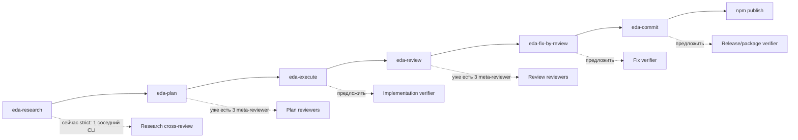

# Агенты для повышения качества работы eda

## 1. Цель и вопросы

**Цель:** понять, какие дополнительные агентские роли стоит добавить в eda-скилы, чтобы повысить качество исследований, планов, исполнения, ревью и публикации без лишнего шума.

**Вопросы:**
1. Где в текущем workflow уже есть мета-проверки?
2. Где качество сейчас держится на одном основном агенте?
3. Какие роли агентов дадут максимум пользы первыми?
4. Что можно добавить только инструкциями в `SKILL.md`, а что потребует изменения установщика?
5. Какие риски появятся от большего числа агентов?

## 2. Диаграммы

## 3. Находки

| # | Факт | Источник | Что это значит |
|---|------|----------|-----------------|
| 1 | В README workflow идёт цепочкой `research -> plan -> execute -> review -> fix-by-review -> commit`, а также связывает `review/fix/fix-by-review` с `automate`. | `README.md:57` | Агенты качества лучше ставить в переходах между этапами, где ошибка переносится дальше по цепочке. |
| 2 | `eda-plan` уже требует три параллельных мета-ревьюера в обычном режиме. | `docs/skills/eda-plan.md:134` | Для планирования не нужен ещё один общий reviewer; полезнее специализировать роли существующих проверок. |
| 3 | `eda-plan` уже нормализует план в исполнимую структуру с целевым алгоритмом, фазами и quality gate. | `docs/skills/eda-plan.md:56`, `docs/skills/eda-plan.md:123` | Дополнительные агенты для plan должны проверять содержание: архитектуру, тесты, эксплуатацию, а не формат. |
| 4 | `eda-review` уже проверяет само ревью тремя параллельными моделями без флага. | `docs/skills/eda-review.md:22`, `docs/skills/eda-review.md:88` | Для review главный прирост даст не больше моделей, а роли: bug/security/test/architecture. |
| 5 | `eda-research` в обычном режиме сохраняет draft без мета-проверки; кросс-ревью есть только в `strict` и только соседним CLI. | `docs/skills/eda-research.md:14`, `docs/skills/eda-research.md:81` | Research сейчас самый слабый входной фильтр: ошибочная находка может испортить plan. |
| 6 | `eda-research` требует ссылку для каждого утверждения. | `docs/skills/eda-research.md:23` | Первый агент для research должен быть fact-checker: ловить неподтверждённые утверждения и слабые источники. |
| 7 | `eda-execute` выполняет план одним основным агентом, пишет тесты внутри шага и делает полный прогон только в конце. | `docs/skills/eda-execute.md:5`, `docs/skills/eda-execute.md:105`, `docs/skills/eda-execute.md:108` | Для execute полезен read-only verification agent перед финалом: он проверит соответствие плану, тесты и риски до review. |
| 8 | `eda-fix` и `eda-fix-by-review` тоже выполняются одним агентом, а проверка в основном тестовая. | `docs/skills/eda-fix.md:23`, `docs/skills/eda-fix-by-review.md:24` | Нужен lightweight diff verifier для фиксов: не полноценное ревью, а контроль, что фикс не расширил задачу и покрыл тестами нужное поведение. |
| 9 | `eda-commit` выбирает файлы, коммитит и после этого управляет push/merge, но не имеет отдельной проверки пакета или публикации. | `docs/skills/eda-commit.md:29`, `docs/skills/eda-commit.md:39` | Для релизов npm нужен release/package verifier: version, pack contents, registry, dirty tree, dist-tag. |
| 10 | Установщик берёт только `docs/skills/*.md` и записывает их как `<skill>/SKILL.md`. | `lib/install.js:74`, `lib/install.js:82`, `lib/install.js:94` | Отдельные файлы `agents/*.md` или шаблоны не попадут в установку без изменения `lib/install.js`; быстрый путь — описывать роли агентов прямо в `SKILL.md`. |
| 11 | README позиционирует eda как 10 самодостаточных скилов с жёсткими границами ответственности. | `README.md:26`, `README.md:84` | Новые агенты не должны размывать границы: verifier не должен править код, commit-agent не должен делать review. |

## 4. Риски и открытые вопросы

| Риск/неясность | Почему важно | Что предлагаешь |
|----------------|---------------|------------------|
| Слишком много агентов замедлит обычный workflow. | `eda-plan` и `eda-review` уже запускают 3 модели; если повторить это везде, скилы станут тяжёлыми. | Ввести уровни: `normal` — 0 или 1 targeted verifier; `strict` — несколько специализированных проверок. |
| Агенты начнут дублировать друг друга. | Общий reviewer часто повторяет уже найденное и добавляет шум. | Давать ролям узкий фокус: fact-checker, test-gap, architecture, release/package. |
| Verifier может начать править вместо проверки. | Границы скилов сейчас явно запрещают смешивать обязанности. | В промптах verifier писать: read-only, только список проблем и рекомендаций, решение принимает главный агент. |
| Отдельные agent-файлы пока не устанавливаются. | Пакет копирует только markdown skills в `SKILL.md`. | Сначала добавить роли в skill-инструкции. Если появится много повторов, потом расширить installer на bundled resources. |
| Research-агенты могут потребовать web-доступ для внешних источников. | Не все исследования требуют интернета, но современные API/законы/версии требуют актуальности. | В `eda-research` явно различить codebase-only research и external research; web verifier включать только когда есть внешние источники. |

## 5. Итог

Главный кандидат на улучшение — `eda-research`: сейчас в обычном режиме он не имеет мета-проверки, хотя его выводы питают `eda-plan`. Я бы добавил туда минимум одного `fact-checker` в normal и три роли в strict: fact-checker, coverage/risk mapper, plan-readiness reviewer. Для `eda-execute` и `eda-fix*` полезнее не параллельные разработчики, а read-only verifier перед финалом: он проверяет соответствие плану, тестовые дыры и незапланированное расширение diff. Для `eda-commit` и публикаций нужен отдельный release/package verifier, потому что npm-релиз зависит от версии, состава tarball, dist-tag и чистоты дерева. В `eda-plan` и `eda-review` уже есть три мета-ревьюера, поэтому там лучше не увеличивать число агентов, а заменить общие проверки на специализированные роли. Отдельные agent-файлы стоит отложить: текущий установщик не копирует ничего кроме `docs/skills/*.md` в `SKILL.md`.

## 6. Рекомендации по агентам

| Приоритет | Агент | Где включить | Режим | Что проверяет | Почему первым |
|---|---|---|---|---|---|
| 1 | `research-fact-checker` | `eda-research` | normal | Все факты имеют источники, источники реально подтверждают утверждения, гипотезы помечены как гипотезы. | Research сейчас отдаёт `draft` без мета-проверки, но дальше влияет на plan. |
| 2 | `research-plan-readiness` | `eda-research strict` | strict | Можно ли по отчёту писать план: есть ли контекст, риски, открытые вопросы, границы задачи. | Закрывает разрыв между research и plan. |
| 3 | `implementation-verifier` | `eda-execute` | normal/strict | Diff соответствует плану, чекбоксы и журнал честные, тесты покрывают изменённое поведение. | Ловит ошибки до отдельного `eda-review`. |
| 4 | `fix-scope-verifier` | `eda-fix`, `eda-fix-by-review` | normal | Фикс не вышел за задачу, замечания применены как написано, тесты не забыты. | Фиксы часто маленькие, но риск расширения scope высокий. |
| 5 | `release-package-verifier` | `eda-commit` или новый `eda-release` | normal | Версия не опубликована, `npm pack --dry-run`, состав tarball, dirty tree, dist-tag после publish. | Непосредственно снижает риск неправильной публикации. |
| 6 | `plan-architecture-reviewer` | `eda-plan` | existing meta-review role | Архитектурные границы, данные, транзакции, внешние эффекты, rollback. | Лучше специализирует уже существующий мета-слой. |
| 7 | `plan-test-reviewer` | `eda-plan` | existing meta-review role | Тестовые сценарии, критерии готовности, команды проверки. | Устраняет типовую проблему планов: шаги есть, проверок мало. |
| 8 | `review-security-reviewer` | `eda-review` | existing meta-review role | Auth, secrets, injection, access control, unsafe operations. | Для code review это отдельная оптика, которую общий reviewer часто пропускает. |
| 9 | `docs-consistency-reviewer` | `eda-docs`, `eda-automate` | strict | Новые правила не противоречат `docs/rules.md`, `docs/arch.md`, README и скилам. | Полезно, но ниже приоритетом, потому что эти скилы не на критическом пути каждого изменения. |

## 7. Предлагаемый порядок внедрения

1. Обновить `eda-research`: добавить normal fact-checker и strict-набор из 3 ролей.
2. Обновить `eda-execute`: добавить read-only verifier перед финальной проверкой и перед финальным ответом.
3. Обновить `eda-fix` и `eda-fix-by-review`: добавить короткий scope/test verifier.
4. Выделить `eda-release` или расширить `eda-commit` релизным режимом с package verifier.
5. После этого специализировать уже существующие meta-review роли в `eda-plan` и `eda-review`.

