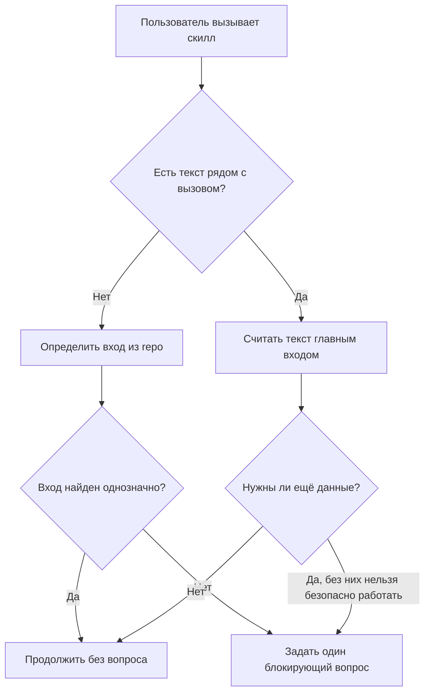

# Учёт текста рядом с вызовом eda-скиллов

## 1. Цель и вопросы

**Цель:** понять, какие eda-скиллы сейчас могут игнорировать текст, написанный рядом с вызовом скилла, и как поправить правила так, чтобы агент не задавал лишние вопросы.

**Вопросы:**
1. Где скилл обязан считать текст пользователя входным контекстом?
2. Где скилл сейчас спрашивает выбор файла или исследования, хотя контекст уже мог быть передан?
3. Какие скиллы уже ведут себя правильно?
4. Какое общее правило нужно добавить во все скиллы?
5. Что конкретно нужно поменять в `eda-plan`?

## 2. Диаграммы



## 3. Находки

| # | Факт | Источник | Что это значит |
|---|------|----------|-----------------|
| 1 | `eda-plan` на этапе контекста всегда требует спросить про релевантное исследование. | `docs/skills/eda-plan.md:40` | Это прямо создаёт проблему: если пользователь уже написал контекст рядом с `$eda-plan`, скилл всё равно полезет спрашивать исследование. |
| 2 | `eda-plan` передаёт в Plan Mode дословный запрос пользователя. | `docs/skills/eda-plan.md:46` | Значит, текст рядом с вызовом уже технически считается входом, но ранний вопрос про research перебивает нормальный flow. |
| 3 | `eda-plan` говорит “если есть неясность”, но вопрос про research стоит раньше и обязателен. | `docs/skills/eda-plan.md:40`, `docs/skills/eda-plan.md:43` | Нужно поменять порядок: сначала понять, есть ли входной текст, потом решать, нужен ли вопрос. |
| 4 | `eda-research` уже начинается с чтения запроса и задаёт вопрос только при неясности. | `docs/skills/eda-research.md:37` | Здесь модель правильная: inline prompt является темой исследования. Можно усилить явной формулировкой, но поведение уже близко к нужному. |
| 5 | `eda-fix` явно поддерживает короткий текст задачи как вход. | `docs/skills/eda-fix.md:14`, `docs/skills/eda-fix.md:39` | Это хороший образец для остальных: “если передан текст — используй его как контекст”. |
| 6 | `eda-review` явно не задаёт вопрос, если цель ревью понятна из запроса или состояния репозитория. | `docs/skills/eda-review.md:20`, `docs/skills/eda-review.md:29` | Это второй хороший образец: “если контекст понятен — не спрашивай”. |
| 7 | `eda-execute` всегда спрашивает план, если путь не передан. | `docs/skills/eda-execute.md:32` | Если пользователь написал “выполни последний план по оплате” или вставил план рядом с вызовом, текущая инструкция не объясняет, как использовать этот текст. |
| 8 | `eda-fix-by-review` всегда спрашивает ревью, если путь не передан. | `docs/skills/eda-fix-by-review.md:35` | Если рядом с вызовом есть номер/название/текст замечаний, скилл может всё равно перейти к списку файлов. |
| 9 | `eda-send-review` всегда спрашивает файл ревью, если путь не передан. | `docs/skills/eda-send-review.md:32` | Нужно разрешить inline-контекст: путь, номер PR, название ревью или явное “последнее ревью”. |
| 10 | `eda-automate` всегда спрашивает диапазон истории. | `docs/skills/eda-automate.md:37`, `docs/skills/eda-automate.md:40` | Если пользователь пишет “проанализируй последние 10 с plans”, вопрос лишний. |
| 11 | `eda-docs` всегда спрашивает, какие документы трогать. | `docs/skills/eda-docs.md:35` | Если пользователь написал “обнови только AGENTS.md”, скилл должен принять это как ответ. |
| 12 | `eda-commit` уже автономен: смотрит состояние, а вопросы задаёт только при разных изменениях или после коммита. | `docs/skills/eda-commit.md:31`, `docs/skills/eda-commit.md:50` | Для commit достаточно добавить общее правило “учитывай inline-инструкции по файлам, сообщению, push/publish”, но не менять основной flow. |

## 4. Риски и открытые вопросы

| Риск/неясность | Почему важно | Что предлагаешь |
|----------------|---------------|------------------|
| Inline prompt может быть слишком расплывчатым. | Если пользователь написал только `$eda-plan`, скилл не знает задачу. | Вопрос задавать только когда нет содержательного текста и нельзя безопасно вывести вход из repo. |
| Inline prompt может конфликтовать с файлами в repo. | Например, пользователь пишет “последний план”, а планов несколько. | Если выбор неоднозначен, задать один точечный вопрос со списком вариантов. |
| Скилл может принять комментарий за команду. | Например, пользователь рассуждает, а агент начинает выполнять. | Считать входом только текст текущего сообщения рядом с вызовом; если это явно вопрос/обсуждение, отвечать в рамках скилла без рискованных действий. |
| `eda-plan` может потерять полезные research-файлы. | Если перестать спрашивать всегда, агент может не использовать уже готовое исследование. | Не спрашивать автоматически, но самому искать явные ссылки в тексте; если research явно нужен и есть несколько кандидатов — спросить. |

## 5. Итог

Проблема реальная и сильнее всего видна в `eda-plan`: он всегда спрашивает про исследование до того, как нормально обработал текст пользователя. Нужно ввести общий принцип для всех скиллов: текст рядом с вызовом — это основной вход, а вопросы задаются только если этого входа нет, он неоднозначен или без уточнения есть риск сделать не то. `eda-fix` и `eda-review` уже почти следуют этому принципу, поэтому их можно использовать как образец. `eda-plan`, `eda-execute`, `eda-fix-by-review`, `eda-send-review`, `eda-automate` и `eda-docs` требуют явных правок. Для `eda-commit` достаточно мягкого уточнения, потому что он уже читает состояние repo и спрашивает только при реальной развилке.

## 6. Предлагаемые правки по скиллам

| Скилл | Что изменить | Поведение после правки |
|---|---|---|
| Все скиллы | Добавить общее правило “Текст рядом с вызовом скилла — главный вход”. | Агент сначала разбирает сообщение пользователя, потом решает, нужен ли вопрос. |
| `eda-plan` | Убрать обязательный вопрос про research. Использовать inline-текст как задачу и контекст плана. Research спрашивать только если текста нет, текст явно просит выбрать исследование, или без research нельзя безопасно планировать. | `$eda-plan сделать webhook ЮKassa ...` сразу строит план по этому описанию. |
| `eda-research` | Явно написать, что inline-текст — тема исследования. Если текста нет, спросить тему. | `$eda-research какие агенты добавить` не требует подтверждения цели, если задача понятна. |
| `eda-execute` | Если inline-текст содержит путь к плану, название плана, “последний план” или сам текст плана — использовать это. Спрашивать список планов только если входа нет или найдено несколько кандидатов. | `$eda-execute последний план по оплате` не показывает список всех планов без необходимости. |
| `eda-fix` | Сохранить текущую логику, добавить общий wording. | Поведение уже правильное. |
| `eda-fix-by-review` | Если inline-текст содержит путь, номер/название ревью или сами замечания — использовать это. | `$eda-fix-by-review замечания 1,3 из последнего ревью` не начинает с общего списка файлов. |
| `eda-review` | Сохранить текущую логику, добавить общий wording. | Поведение уже правильное. |
| `eda-send-review` | Если inline-текст содержит путь к ревью, “последнее ревью”, PR номер или тип отправки — использовать это как вход. Подтверждение approve/request-changes оставить обязательным. | `$eda-send-review последнее ревью в PR 12 как comment` не спрашивает файл ревью. |
| `eda-automate` | Если inline-текст задаёт диапазон (`plans`, последние N, период, конкретные файлы), не спрашивать диапазон. | `$eda-automate plans последние 10` сразу анализирует нужный набор. |
| `eda-docs` | Если inline-текст указывает документы (`rules`, `arch`, `AGENTS`, “все”), не спрашивать “что трогаем”. Для существующих файлов вопрос про переписать/дополнить оставить. | `$eda-docs обнови только AGENTS.md` сразу выбирает AGENTS. |
| `eda-commit` | Если inline-текст задаёт файлы, сообщение, push/publish намерение — учитывать это, но опасные действия всё равно подтверждать по правилам. | `$eda-commit только docs/skills/eda-plan.md и push` не должен пытаться включить несвязанные файлы. |

## 7. Минимальный общий текст для вставки

```markdown
## Вход из сообщения пользователя

Текст рядом с вызовом скилла — главный вход. Сначала разбери его: путь к файлу, название артефакта, режим, ограничения, дополнительные требования и сам текст задачи. Не задавай вопрос, если из этого текста можно безопасно продолжать.

Задавай `AskUserQuestion` только если:
- входа нет;
- вход противоречивый;
- найдено несколько одинаково подходящих файлов или вариантов;
- без ответа можно выполнить не ту задачу или сделать рискованное действие.
```

## 8. Специальная правка для `eda-plan`

```markdown
### 1. Подтянуть контекст
Сначала разбери текст рядом с вызовом `eda-plan`. Если там есть описание задачи, требования, ограничения, ссылки на файлы или вставленный контекст — это и есть основной контекст плана. Не спрашивай отдельно, какое исследование использовать.

Прочитай `docs/rules.md`, `docs/arch.md` (если есть) и строго следуй им. Если в тексте пользователя есть ссылка на `docs/researches/...`, прочитай её. Если пользователь явно просит опереться на исследование, но не указал файл, тогда покажи последние файлы из `docs/researches/` и спроси, какой взять. Если текста задачи нет совсем — спроси, что планируем.
```

